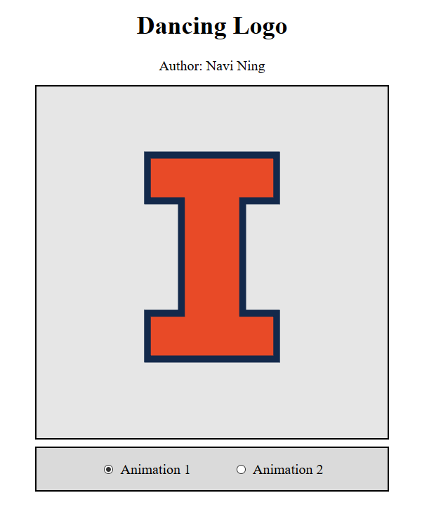
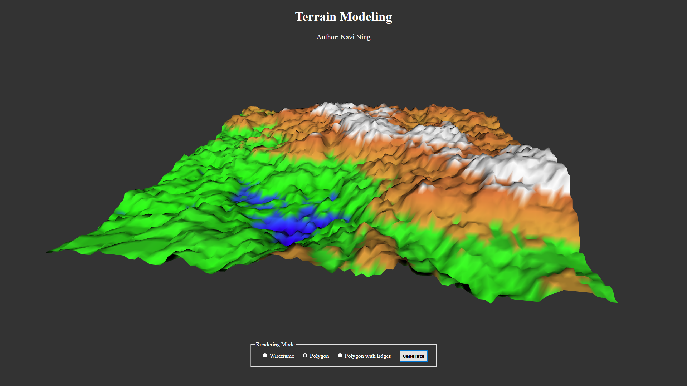
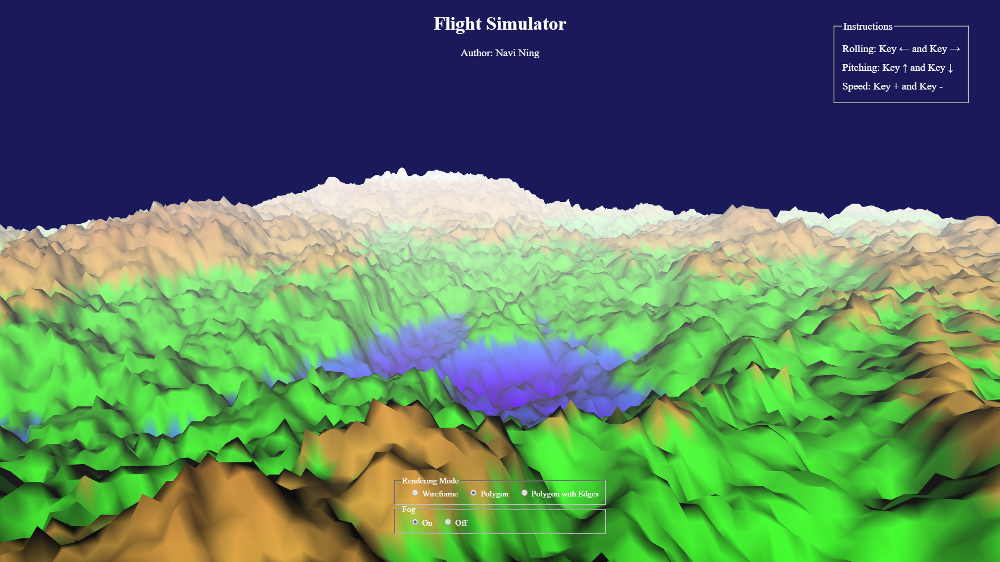
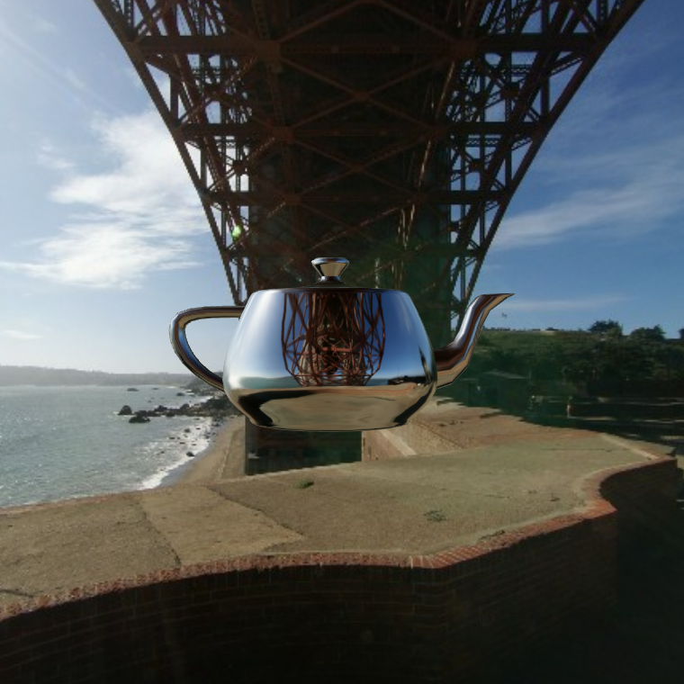
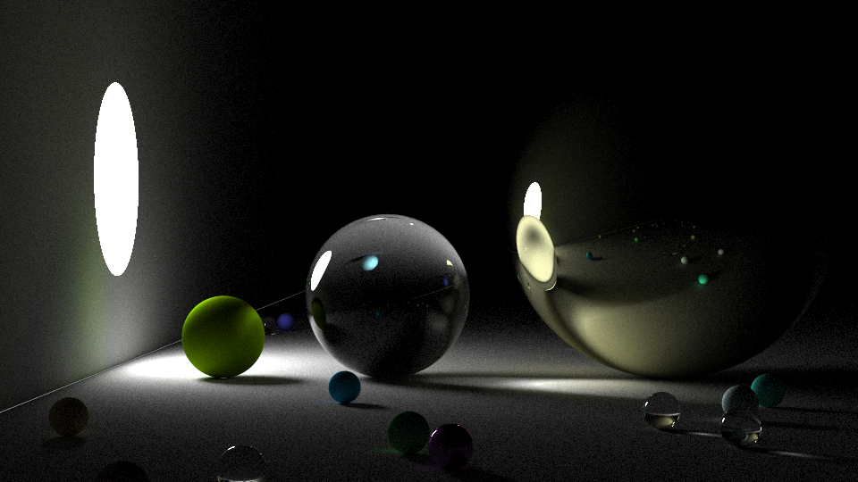

# CS 418 MPs
Machine Problems of CS 418 Interactive Computer Graphics: [navining.me/CS-418-MPs](https://navining.me/CS-418-MPs/)

This repository is for personal study only. 

All rights reserved. **Any form of copy is NOT allowed**.

### MP1: Dancing Logo

### MP2-1: Terrain Modeling

### MP2-2: Flight Simulator

### MP3: Environment Mapping

### MP4: A Simple Physics Engine

### Project: Ray Tracing

